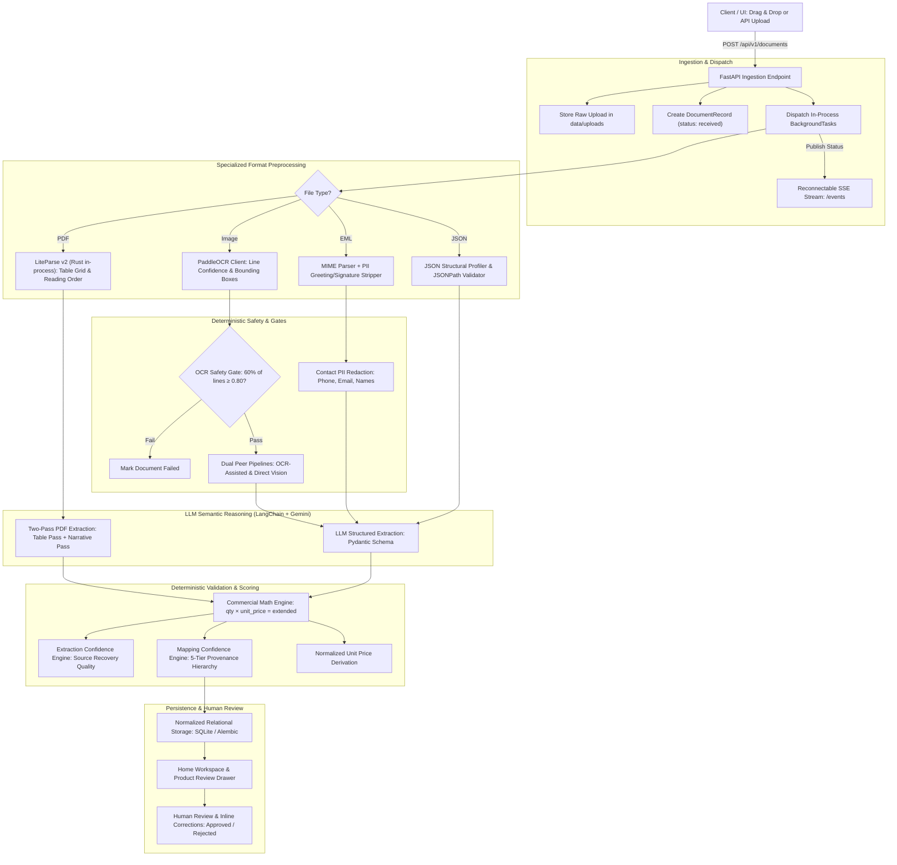
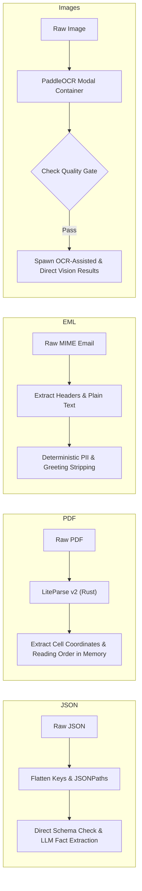
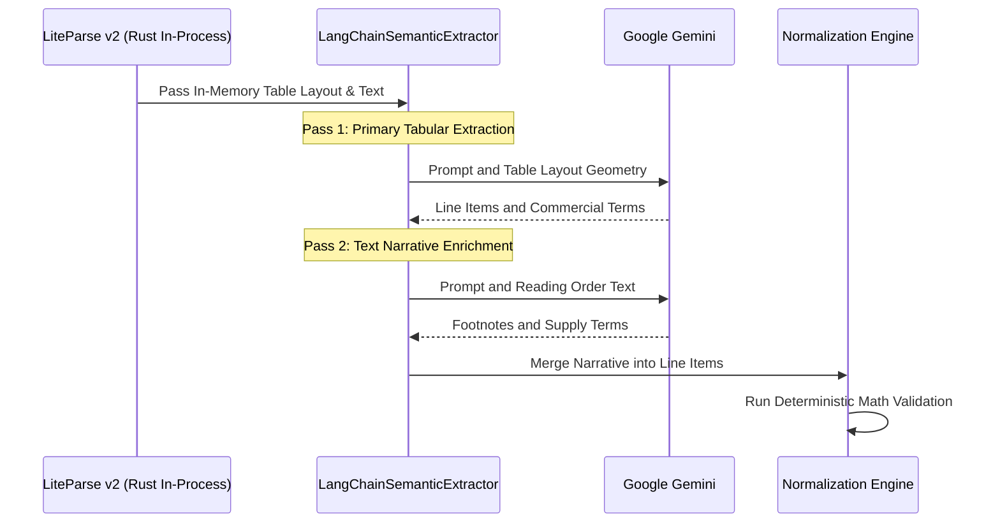
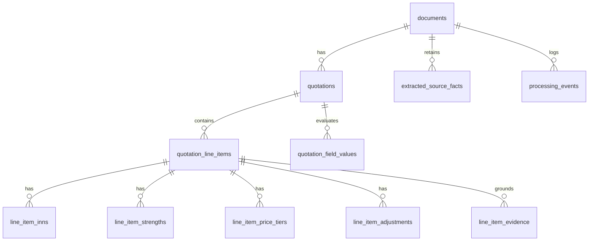

# System Architecture Deep Dive

> Purpose: comprehensive architectural blueprint of ingestion, preprocessing, deterministic validation, LLM extraction, and persistence.
> Status: active and synchronized with multi-format intake, dual confidence scoring, native LiteParse v2, and human review workflows.
> Update whenever intake pipelines, parser integrations, deterministic rules, or LLM contracts change.
> Owner persona: systems maintainer / architecture team.
> Related: `docs/system/architecture.md`, `docs/product/axmed_document_intelligence_prd.md`, `backend/app/README.md`.
> Search terms: architecture, ingestion, deterministic, llm, gemini, liteparse, paddleocr, confidence, normalization.
> All components link directly to executable code paths and tests.

---

## 1. High-Level Architectural Flow

```text
  [ Client / Web UI ]
          │  POST /api/v1/documents (Single or Multi-file)
          ▼
┌──────────────────────────────────────────────────────────┐
│              FASTAPI INGESTION ENDPOINT                  │
│  • Disk storage (data/uploads) with collision-free UUID  │
│  • Create DocumentRecord: status = 'received'            │
│  • Dispatch in-process BackgroundTasks (isolated)        │
│  • Publish real-time lifecycle events via SSE (/events)  │
└──────────────────────────┬───────────────────────────────┘
                           │
                           ▼
┌──────────────────────────────────────────────────────────┐
│          SPECIALIZED FORMAT PREPROCESSING                │
├──────────────┬──────────────┬──────────────┬─────────────┤
│     JSON     │     PDF      │     EML      │    IMAGE    │
│  Structural  │  LiteParse   │  MIME parser │  PaddleOCR  │
│  profiling & │  v2 (Rust)   │  PII & email │  line & box │
│  JSONPaths   │  in-process  │  greeting    │  confidence │
│  validation  │  grid & text │  redaction   │  extraction │
└──────┬───────┴──────┬───────┴──────┬───────┴──────┬──────┘
       │              │              │              │
       │              │              │      ┌───────┴────────┐
       │              │              │      │ OCR Safety Gate│
       │              │              │      │ >=60% lines    │
       │              │              │      │ score >=0.80   │
       │              │              │      └───┬────────┬───┘
       │              │              │     Pass │        │ Fail
       │              │              │          ▼        ▼
       │              │              │     ┌─────────┐ ┌────────┐
       │              │              │     │Peer Dual│ │ Mark   │
       │              │              │     │Results: │ │Document│
       │              │              │     │• OCR-txt│ │ Failed │
       │              │              │     │• Vision │ └────────┘
       │              │              │     └────┬────┘
       ▼              ▼              ▼          ▼
┌──────────────────────────────────────────────────────────┐
│      LLM SEMANTIC REASONING (LangChain + Gemini)         │
│  • Structured Pydantic Output: CanonicalQuotation        │
│  • Two-Pass PDF: 1. Table Geometry -> 2. Text Narrative  │
│  • Entity Resolution: Trade name vs INN array            │
│  • Rules: Incoterm != Origin; Transit duration != Lead   │
│  • Discourse: Chronological supersession & corrections   │
└──────────────────────────┬───────────────────────────────┘
                           │
                           ▼
┌──────────────────────────────────────────────────────────┐
│       DETERMINISTIC VALIDATION & CONFIDENCE SCORING      │
│  • Commercial Math: qty × unit_price == extended_price   │
│  • Pack Price Check: pack_price == unit × units_per_pack │
│  • Unit Price Normalization (Zero generic UOM fallback)  │
│  • Extraction Confidence: Source recovery quality score  │
│  • Mapping Confidence: 5-Tier provenance hierarchy       │
└──────────────────────────┬───────────────────────────────┘
                           │
                           ▼
┌──────────────────────────────────────────────────────────┐
│        PERSISTENCE, AUDITING & HUMAN REVIEW              │
│  • Normalized Relational SQLite DB (Alembic migrations)  │
│  • First-class field_reviews tracking each mapped value  │
│  • Unmapped source facts retained for compliance audit   │
│  • Web UI: Home table, Product Detail Drawer             │
│  • Reviewer actions: Inline field edit -> Approved/Reject│
│  • CSV Export: Complete multi-source product breakdown   │
└──────────────────────────────────────────────────────────┘
```

<details>
<summary>Mermaid Diagram (Click to expand if your editor supports Mermaid rendering)</summary>



</details>

---

## 2. Ingestion Pipeline & Background Lifecycle

### Ingestion Endpoint Design
- **Single Ingest Seam**: All document ingestion occurs through `POST /api/v1/documents` in [`backend/app/api.py`](file:///Users/andrewsboateng/Projects/axmed-takehome/backend/app/api.py).
- **Batch Isolation**: The endpoint accepts single or multi-file uploads (`list[UploadFile]`). Each document is scheduled independently in an isolated task context. A failure in one document does not fail or halt peer documents in the same batch.
- **Collision-Free Storage**: Uploaded files are streamed to disk under `backend/data/uploads/` using secure UUID-prefixed file names while preserving original filenames and MIME types in metadata.
- **Payload Limits**: Upload size is capped at 15 MB per file.

### Async Processing Without Heavy Queues
The backend leverages FastAPI's in-process `BackgroundTasks` without requiring external broker daemons (such as Celery, Redis, or RabbitMQ):
1. Upon upload, a `DocumentRecord` is created in SQLite with status `received`.
2. As extraction progresses, the pipeline persists discrete `ProcessingEventRecord` entries tracking lifecycle phases: `preparation`, `ocr`, `semantic_extraction`, `normalization`, `completed`, or `failed`.
3. Clients consume real-time updates via **Server-Sent Events (SSE)** at `GET /api/v1/documents/{id}/events`. In case of client disconnection, the browser passes `Last-Event-ID` to replay the complete audit trail.

---

## 3. File Types & Specialized Preprocessing

```text
  ┌───────────────────────────────────────────────────────────┐
  │                    SOURCE PREPROCESSING                   │
  └─────┬───────────────┬────────────────┬──────────────┬─────┘
        │               │                │              │
        ▼               ▼                ▼              ▼
   ┌─────────┐    ┌───────────┐    ┌───────────┐  ┌───────────┐
   │  JSON   │    │    PDF    │    │    EML    │  │   IMAGE   │
   └────┬────┘    └─────┬─────┘    └─────┬─────┘  └─────┬─────┘
        │               │                │              │
        ▼               ▼                ▼              ▼
   Flatten Keys    LiteParse v2     MIME Parser   PaddleOCR GPU
   & JSONPath      Native Rust      Strip PII &   Line & Bounding
   Pointers        In-Process       Greetings     Box Coordinates
        │               │                │              │
        │               │                │              ▼
        │               │                │      Check Safety Gate
        │               │                │      (>=60% lines >=0.8)
        │               │                │       ├── Pass: OCR + Vision
        │               │                │       └── Fail: Exit
        ▼               ▼                ▼              ▼
  ─────────────────────────────────────────────────────────────
                  Input to Semantic Pipeline
```

<details>
<summary>Mermaid Diagram</summary>



</details>

### JSON Documents
- **Structural Profiling**: Handled by `profile_json_structure` in [`backend/app/extraction/json.py`](file:///Users/andrewsboateng/Projects/axmed-takehome/backend/app/extraction/json.py).
- **Pointer Tracking**: Extracts every key-value pair and records its exact JSONPath pointer (e.g., `$.line_items[0].pricing.quoted_price.amount`).
- **Ground Truth Verification**: If an extractor claims a source value, the deterministic engine validates that the JSONPath actually exists and the value matches before permitting it into canonical quotation state.
- **Unmapped Fact Retention**: Unmapped fields are stored in `extracted_source_facts` for compliance audits rather than lowering extraction confidence or raising spurious review errors.

### PDF Documents (LiteParse v2.0 Native Rust Engine)
- **In-Process Native Execution**: Handled by [`backend/app/extraction/pdf_parser.py`](file:///Users/andrewsboateng/Projects/axmed-takehome/backend/app/extraction/pdf_parser.py) via `liteparse>=2.14.4`. LiteParse v2 is compiled in Rust against a custom PDFium build and `tesseract-rs`, running natively in Python process memory via PyO3 bindings.
- **Decoupled from Node.js**: Completely removes external Node.js, `npm`, `npx`, and CLI subprocess invocation. It eliminates process launch overhead, achieving a 5–100x speedup on small documents and ~3x on large files.
- **No Naive Conversions**: Explicitly rejects hand-crafted universal table/Markdown reconstruction layers.
- **Dual Representation**:
  1. *Spatial Table Geometry*: Bounding boxes, row/column indices, cell text items (`x`, `y`, `width`, `height`, `confidence`).
  2. *Clean Reading-Order Text*: Coherent text stream for narrative clauses, delivery conditions, and footnotes.
- **Evidence Retention**: The parsed page representation (`raw_representation`) is preserved permanently as ground truth evidence.

### EML (Email Correspondence)
- **MIME Parsing**: Handled by [`backend/app/extraction/email_parser.py`](file:///Users/andrewsboateng/Projects/axmed-takehome/backend/app/extraction/email_parser.py).
- **PII Minimization**: Strips conversational email greetings, sign-offs, signatures, and legal disclaimers before feeding prompt context to external LLMs.
- **Redaction**: Deterministically redacts phone numbers, personal email addresses, and contact patterns via [`backend/app/security/redaction.py`](file:///Users/andrewsboateng/Projects/axmed-takehome/backend/app/security/redaction.py).

### Images (Scanned Faxes, JPEGs, PNGs)
- **OCR Service**: Powered by PaddleOCR running on an isolated GPU container via [`backend/app/extraction/ocr_client.py`](file:///Users/andrewsboateng/Projects/axmed-takehome/backend/app/extraction/ocr_client.py).
- **Continuous Quality Signal & Hard Safety Gate**:
  - Requires at least **60% of detected lines** to have an OCR confidence **>= 0.80**.
  - Documents failing this gate immediately exit as `failed` to prevent hallucinated extractions on degraded images.
- **Dual Peer Approach (No Automatic Winner)**:
  1. *OCR-Assisted*: Passes verified OCR text tokens and bounding boxes to the model.
  2. *Direct Vision*: Generates a masked image containing only verified OCR regions and sends it to Gemini Multimodal.
  - Both attempts are saved and presented as peer source results for human reviewer inspection.

---

## 4. Deterministic Pipeline: Logic, Validation, and Confidence

Business rules and mathematical validations are strictly isolated from LLM reasoning.

### Commercial Validation Engine ([`backend/app/extraction/commercial.py`](file:///Users/andrewsboateng/Projects/axmed-takehome/backend/app/extraction/commercial.py))
- **Extended Price Check**:
  $$\text{Calculated} = \text{quoted\_quantity} \times \text{quoted\_price} \times \left(1 - \frac{\text{discount}}{100}\right)$$
  - Evaluated against source `extended_price` using Python `Decimal` arithmetic.
  - Results in `passed`, `conflicting`, or `unavailable`.
- **Pack Price Cross-Check**: Confirms $\text{pack\_price} = \text{unit\_price} \times \text{units\_per\_pack}$.
- **Tier & Range Bounds**: Validates non-overlapping volume tiers and percentage limits $[0, 100]$.

### Unit Price Normalization
- If quoted in packs, boxes, or shippers, the engine derives `normalized_price` per basic clinical unit (e.g. tablet, capsule, vial).
- Stores the derivation formula (e.g. `pack_price / units_per_pack`) and validation status.
- **Zero Generic Fallbacks**: The system never guesses or invents an arbitrary UOM (such as `"unit"`). If units per pack are missing, `normalized_price` remains null.

### Two-Dimensional Confidence Scoring Engine ([`backend/app/extraction/confidence.py`](file:///Users/andrewsboateng/Projects/axmed-takehome/backend/app/extraction/confidence.py))

```
                    Confidence Architecture
    ┌─────────────────────────────────────────────────────┐
    │ 1. Extraction Confidence (Source Recovery Quality)   │
    │    Weighted sum: Parser Fidelity + OCR Quality +    │
    │    Readability + Independent Agreement              │
    └─────────────────────────────────────────────────────┘
    ┌─────────────────────────────────────────────────────┐
    │ 2. Mapping Confidence (Schema Assignment Quality)   │
    │    5-Tier Provenance Hierarchy:                     │
    │    • 100%: Explicit Schema Key                      │
    │    •  92%: Tabular Grid Row/Cell Pointer            │
    │    •  82%: Found in Source, Implicit Label          │
    │    •  70%: Extracted Without Saved Location         │
    │    •  30%: Active Conflict or Contradiction         │
    │    (+5% Bonus when Commercial Math passes)          │
    └─────────────────────────────────────────────────────┘
```

1. **Extraction Confidence (Document Level)**:
   Measures the physical fidelity of data extraction:
   $$\text{Score} = \sum (\text{Weight}_i \times \text{FactorScore}_i)$$
2. **Mapping Confidence (Field & Line Level)**:
   Measures whether values are attached to the correct canonical schema fields:
   - **100% (High)**: Explicit 1:1 schema key match (e.g., native JSON key).
   - **92% (High)**: Grounded in specific row, column, or cell coordinates.
   - **82% (Medium)**: Found in source text or path, but label not 1:1 explicit.
   - **70% (Medium)**: Extracted value, but exact coordinates/path not recorded.
   - **30% (Low)**: Source key contradicts field or math checks conflict.
   - **+5% Math Bonus**: Awarded when commercial validations pass (`related values agree`).

---

## 5. LLM Semantic Reasoning: LangChain + Gemini

The LLM is invoked strictly for semantic synthesis, entity resolution, and discourse reasoning.



### Engine Configuration ([`backend/app/extraction/llm.py`](file:///Users/andrewsboateng/Projects/axmed-takehome/backend/app/extraction/llm.py))
- **Framework**: LangChain with `ChatGoogleGenerativeAI`.
- **Model**: `gemini-3.1-flash-lite` (or `gemini-2.5-flash`), with `temperature=0.0`.
- **Pydantic Structured Output**: Extraction calls use `.with_structured_output(CanonicalQuotation)` ensuring valid typing and schema conformance.

### Domain Extraction Rules
1. **Chronological Supersession**: When email correspondence or notes revise earlier quotes (e.g., *"quoted EUR 0.128, corrected in P.S. to EUR 0.134"*), the model extracts the final price and records `supersedes_source_path` in evidence.
2. **Pharmaceutical Entity Resolution**:
   - Disentangles proprietary `trade_name` from generic active ingredients (`inn` array).
   - Separates active moieties from counter-ions/salts (e.g. *Amoxicillin* base moiety paired with *potassium clavulanate* salt).
   - Preserves complete clinical dosage forms (*"film-coated tablet"*, *"solution for injection"*), never stripping route into packaging.
3. **Incoterms vs. Origin Boundary**: An Incoterm named place (e.g., *"FOB Paris"*) is extracted as **commercial delivery context**, and is **never** inferred as `country_of_origin`.
4. **Transit vs. Lead Time**: Shipping transit duration is never conflated with manufacturer lead time unless explicitly stated as lead time.
5. **Two-Pass PDF Extraction**:
   - **Pass 1 (Table Geometry Pass)**: Extracts line items, quantities, unit prices, and packaging configurations from table layout coordinates.
   - **Pass 2 (Narrative Enrichment Pass)**: Reads sequential narrative text and footnotes to populate missing supply (`shelf_life_months`, `storage_conditions`, `lead_time_days`) and regulatory fields without overriding table facts.

---

## 6. Final Output & Relational Persistence

Extracted data is normalized into SQLite using SQLAlchemy and Alembic migrations ([`backend/app/models.py`](file:///Users/andrewsboateng/Projects/axmed-takehome/backend/app/models.py)).



### Data Layer Schema
- **`documents`**: Source metadata, format badge, upload hash, overall `extraction_confidence`, and `mapping_confidence`.
- **`quotations`**: Supplier name, quotation reference, RFQ reference, commercial terms, and immutable JSON revision snapshot (`payload_json`).
- **`quotation_line_items`**: Relational projection of line items with child tables for multi-ingredient INNs, strength specs, and price tier structures.
- **`quotation_field_values`**: First-class tracking of every single mapped field, storing its value, canonical path, reliability band, numeric mapping confidence score, and human review status.
- **`extracted_source_facts`**: Unmapped source facts with their JSONPath for compliance and auditing.
- **`processing_events`**: Audit trail of extraction stages for real-time client replay.

### Human Review & Operational Actions
- **State Progression**:
  $$\text{received} \longrightarrow \text{processing} \longrightarrow \text{pending\_review} \longrightarrow \text{approved} \text{ or } \text{rejected}$$
- **Inline Corrections**: Reviewers can edit any extracted field in the `ProductDetailDrawer`. Saving a correction automatically recalculates commercial math and audits before/after states.
- **CSV Export**: `GET /api/v1/documents/export.csv` reads the persisted backend projection and emits terminal results as one user-facing row per extracted product, or one summary row for a terminal productless source. Completed image attempts become distinct OCR-assisted and Direct vision sources. The frontend only downloads this response. Active processing records and internal identifiers/state labels are excluded, while file format, failure context, confidence explanations, consolidated mapping issues, and review decisions remain.

---

## 7. Deployment & Environment Configuration

### Unified Python Service
- **Runtime Environment**: Python 3.12/3.13 managed via `uv`.
- **Cloud Deployment ([`backend/railpack.json`](file:///Users/andrewsboateng/Projects/axmed-takehome/backend/railpack.json))**:
  ```json
  {
    "$schema": "https://schema.railpack.com",
    "provider": "python"
  }
  ```
  The backend builds as a pure Python container with no Node 22, npm, or cross-runtime tooling overhead. Native extensions (such as `liteparse` Rust binaries) are resolved directly from PyPI platform wheels during container build.
- **Unified Local Supervisor**: `bin/dev` (or `make dev`) starts FastAPI and the Vite Vue 3 frontend simultaneously under a single coordinated development process.
